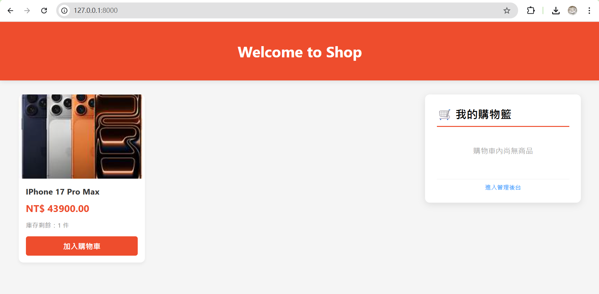
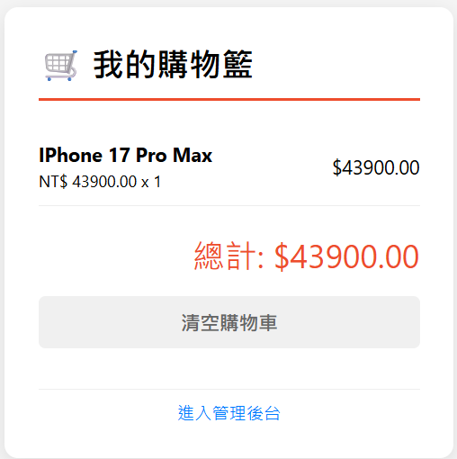
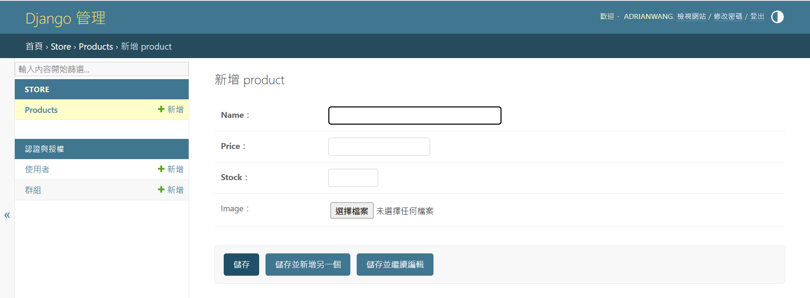

購物商場系統 - 軟體工程實作作業
這是一個基於 Python Django 框架開發的完整電商系統。本專案實作了從資料庫建模、後端邏輯處理、前端響應式介面到購物車 Session 狀態管理的全流程開發。

🌟 核心功能說明
動態商品展示：透過 Django Model 儲存商品資訊（名稱、價格、庫存、圖片），並即時呈現在前端。

購物車系統：利用 Django Session 技術實作「加入購物車」與「清空購物車」，支援跨頁面狀態保存。

媒體管理 (Media Management)：整合 Pillow 套件，支援後台即時上傳商品圖片並動態生成 URL。

響應式佈局：前端採用 CSS Grid 與 Flexbox 佈局，確保在不同解析度下皆能優雅顯示。

🛠️ 開發環境與技術棧
後端框架：Django 5.2.9

資料庫：SQLite 3

圖片處理：Pillow (PIL)

版本控制：Git / GitHub

🚀 老師點評與執行步驟
若要在您的本地環境運行此專案，請依照以下步驟操作：

1. 安裝必要套件
本專案需要 Django 以及處理圖片的 Pillow 套件：

Bash

pip install django pillow
2. 執行資料庫遷移
確保資料庫結構與代碼一致：

Bash

python manage.py makemigrations
python manage.py migrate
3. 啟動開發伺服器
Bash

python manage.py runserver
啟動後請訪問：http://127.0.0.1:8000/

📂 專案架構說明
myshop/：專案核心配置（Settings, URL 路由）。

store/：核心應用程式（Models 定義資料、Views 處理邏輯）。

templates/：存放 index.html 樣式模板。

media/：存放使用者透過後台新增的商品圖片檔案。

💡 實作心得 (軟體工程實踐)
在本專案中，我們實踐了 MTV (Model-Template-View) 設計模式，確保代碼具備良好的解耦性。特別是在處理大量檔案提交至 GitHub 時，學習到了如何透過版本控制系統有效管理專案生命週期。
